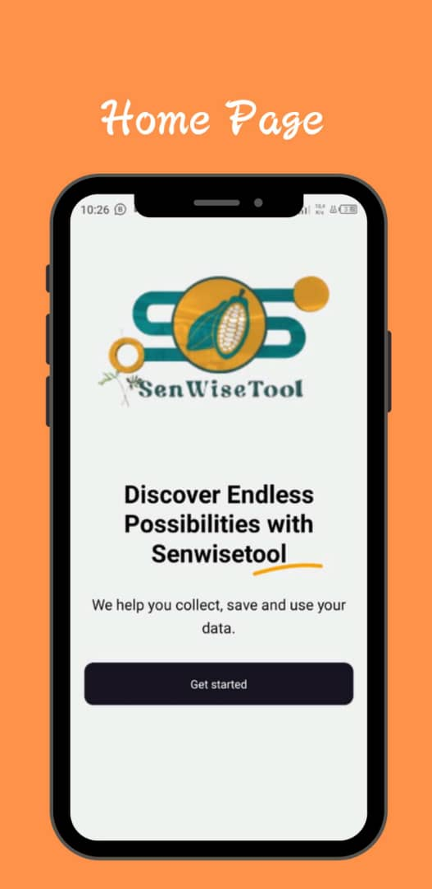
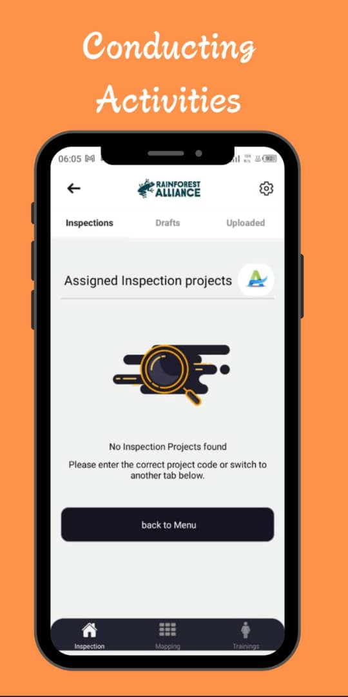
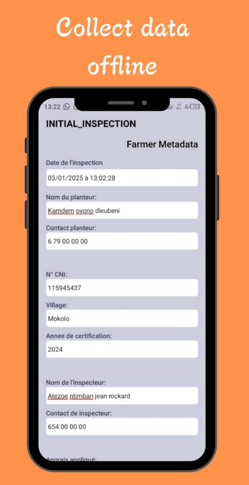
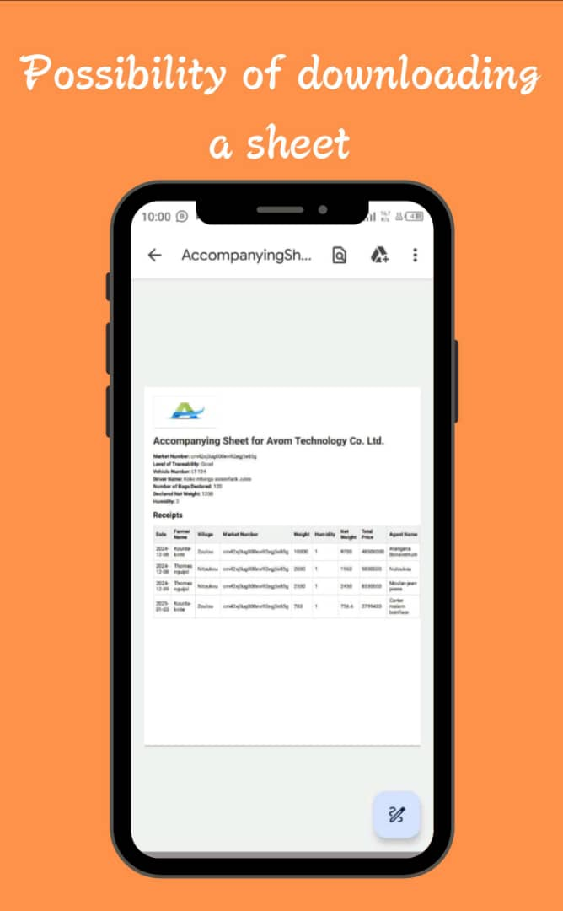

# Agriculture Durability Mobile App

A professional **Expo / React Native** mobile application for **agriculture durability**, supporting inspections, mapping, training, and traceability workflows for the agricultural sector.

---

## Banner

| 1 | 2 | 3 | 4 | 5 |
|:---:|:---:|:---:|:---:|:---:|
|  |  |  |  |  |
| *img_1* | *img_2* | *img_3* | *img_4* | *img_5* |

---

## Overview

This app enables field agents and administrators to manage **inspections**, **mappings**, and **trainings**, and to handle **traceability** documents (receipts, sale slips, store entry vouchers, transmission sheets, etc.) in line with sustainable agriculture practices.

### Features

- **Inspections** — Draft, send, and manage inspection projects; view and edit inspection details and summaries.
- **Mappings** — Create and manage mapping projects with draft and sent workflows; edit mapping details.
- **Trainings** — Manage training modules, attendance sheets, drafts, and sent training projects.
- **Traceability** — Markets, receipts, accompanying sheets, sale-slip sheets, store-entry vouchers, and transmission sheets.
- **Authentication** — Admin and agent auth flows, workspace selection, and session handling.
- **Offline & storage** — MMKV and AsyncStorage for local data; support for offline-capable workflows.

### Tech stack

| Category | Technologies |
|----------|--------------|
| **Framework** | React Native 0.74, Expo SDK 51 |
| **Routing** | Expo Router (file-based) |
| **Styling** | NativeWind (Tailwind CSS), React Native Paper |
| **State** | Zustand, React Query (TanStack Query) |
| **Forms** | React Hook Form |
| **Maps** | react-native-maps, Turf.js |
| **Storage** | MMKV, Expo Secure Store, AsyncStorage |
| **Auth** | Clerk (Expo), JWT (expo-jwt) |
| **Build & OTA** | EAS Build, EAS Update |

---

## Prerequisites

- **Node.js** (LTS recommended)
- **Yarn**
- **Expo CLI** (optional; `npx expo` is enough)
- **iOS**: Xcode and CocoaPods (macOS only)
- **Android**: Android Studio and JDK 17
- **EAS**: Expo account and EAS CLI for builds (`npm i -g eas-cli`)

---

## Setup

```bash
# Clone and enter the project
cd "agriculture-durability-mobile app"

# Install dependencies
yarn install

# Copy environment template and set variables (see .env.example)
cp .env.example .env
```

Configure `.env` with at least:

- `EXPO_PUBLIC_GOOGLE_MAPS_API_KEY` — for maps (optional but recommended for mapping features)
- `EXPO_PUBLIC_EAS_PROJECT_ID` — for EAS Build/Update (optional)

---

## Scripts

| Script | Description |
|--------|-------------|
| `yarn start` | Start Expo dev client |
| `yarn android` | Run on Android |
| `yarn ios` | Run on iOS |
| `yarn web` | Run in web browser |
| `yarn test` | Run tests in watch mode |
| `yarn test:ci` | Run tests once with coverage (CI) |
| `yarn lint` | Run ESLint |
| `yarn lint:fix` | Fix lint issues |
| `yarn format` | Format with Prettier |
| `yarn clean` | Remove `.expo` and `node_modules` |

---

## EAS (Expo Application Services)

- **Build profiles** (`eas.json`): `development`, `preview`, `preview_debug`, `production` (shared `base` with env and Node/Yarn).
- **Channels**: `development`, `preview`, `production` for OTA updates.
- **Local build example**:  
  `eas build --profile preview --platform android`
- **GitHub Actions**: Use `.github/workflows/eas-build.yml` for builds on `v*` tags or manual dispatch. Configure `EXPO_TOKEN` in repository secrets.

---

## Testing

- **Jest** + **jest-expo** for unit and component tests.
- Config: `jest.config.js` (path alias `@/`, transformIgnorePatterns for RN/Expo).
- **Run once**: `yarn test:ci`  
- **Watch mode**: `yarn test`

---

## Code quality

- **ESLint**: Expo config + Prettier + TypeScript (`.eslintrc.cjs`).
- **Prettier**: `.prettierrc` / `.prettierignore`.
- **CodeRabbit**: `.coderabbit.yaml` for AI-assisted code review on PRs (path filters, ESLint/Jest in pre-merge).

---

## Project structure (high level)

```
app/                    # Expo Router screens (file-based routes)
  (admin)/              # Admin: inspections, mappings, trainings
  (auth)/               # Sign-in, admin/agent auth
  (management)/         # Inspections, mappings, trainings management
  (traceability)/       # Traceability documents and markets
  (modals)/             # Account, workspace, lock, select chapter
components/             # Reusable UI and feature components
  gestion/              # Inspections, mapping, training UIs
  tracability/          # Traceability-related components
  global/               # Dropdowns, inputs, signatures
assets/                 # Fonts, icons, images (e.g. banner-img)
lib/                    # API, utils, logger
store/                  # Zustand stores (auth, projects, etc.)
constants/              # Colors, icons, images config
```

---

## License

MIT.
